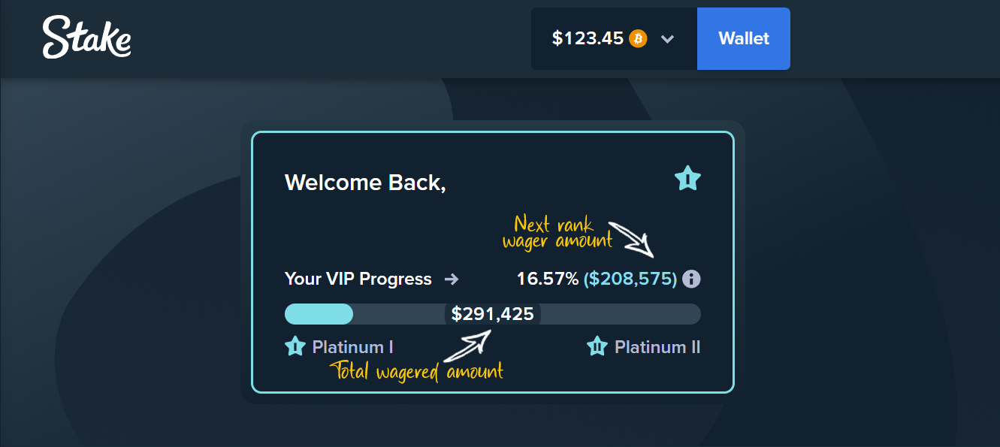

# Stake.com VIP Rank Progress
This extension provides users with insights into their VIP rank progress in Stake.com online casino. 
It calculates the amount required for the next VIP rank and displays this information directly on the web page.

## Installation
Easiest way to install is by visiting either the Chrome web store or Mozilla Addons and download the extension:
### Chrome Web Store:
TBD

### Mozilla Addons
TBD

### Running locally
Clone this repository: `git clone https://github.com/ocp1006/stake.com-vip-rank-progress.git`

Chromium based browser

1. Type `chrome://extensions/`
2. Enable "Developer mode".
3. Click on "Load unpacked".
4. Navigate to the directory where you cloned the repository and select it.
 

Mozilla Firefox (Nightly or developer edition only)

1. Type `about:debugging`.
2. Click on "Load Temporary Add-on".
3. Navigate to the directory where you cloned the repository and select the `manifest.json` file.
 

## Usage

Navigate to Stake.com homepage. The extension will automatically calculate and display the required amounts on the page.

## Privacy
> [!IMPORTANT]
> Your privacy is important. All calculations are done directly in the browser. 
> No data is collected, stored, or sent to any external servers.

## Contributing

Pull requests are welcome. For major changes, please open an issue first to discuss what you would like to change.

## License

[MIT](https://choosealicense.com/licenses/mit/)

## Disclaimer

This extension is not affiliated, associated, authorized, endorsed by, or in any way officially connected with Stake.com, its webside or any of its subsidiaries or its affiliates. The official Stake website can be found at its respective domain. The name as well as related names, marks, emblems, and images are registered trademarks of their respective owners.
